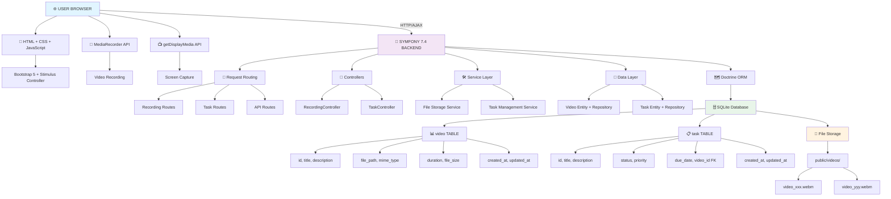
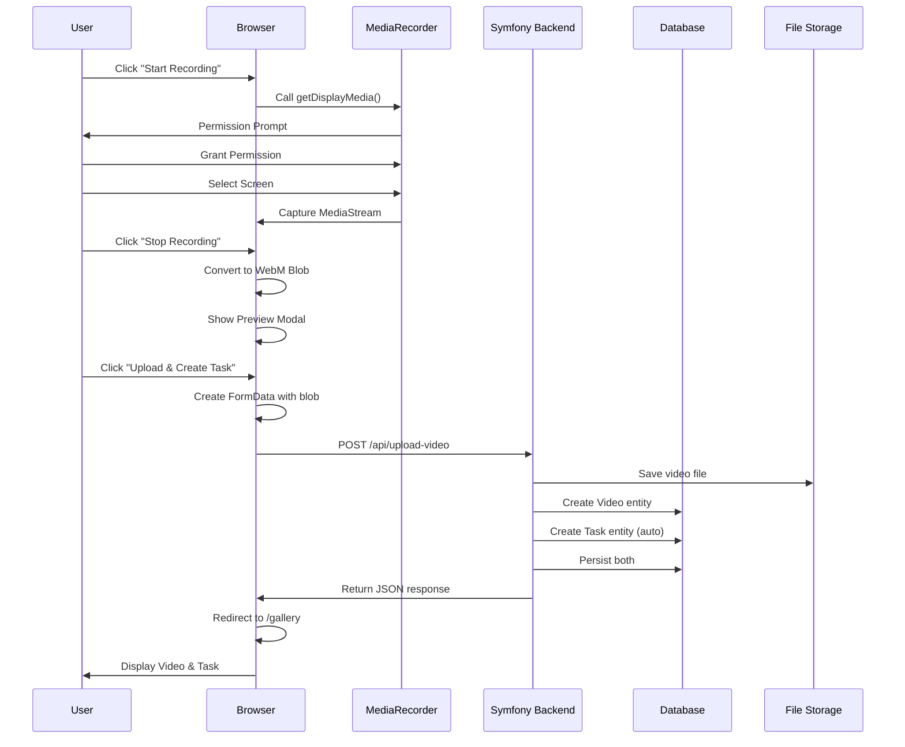
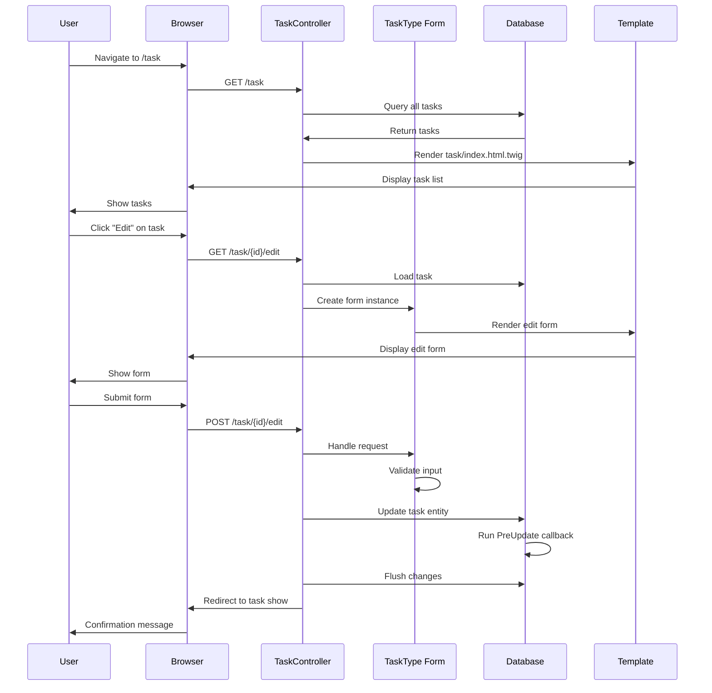
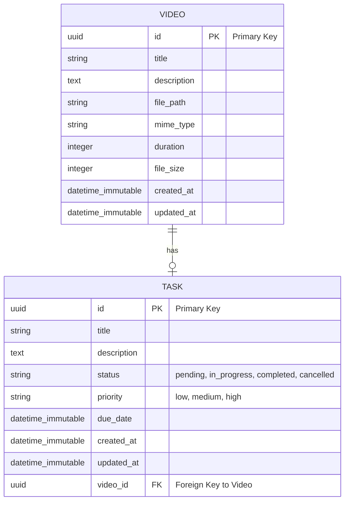
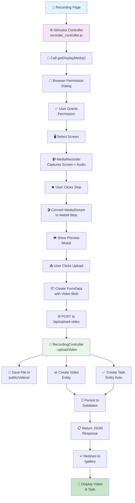
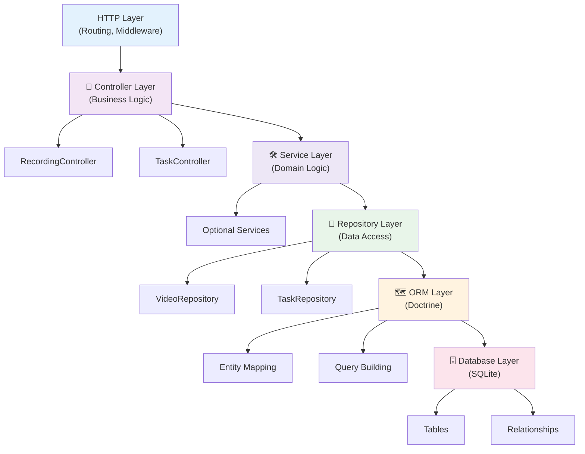
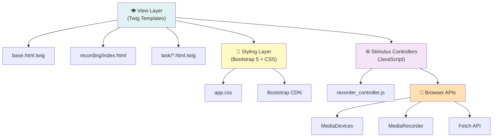
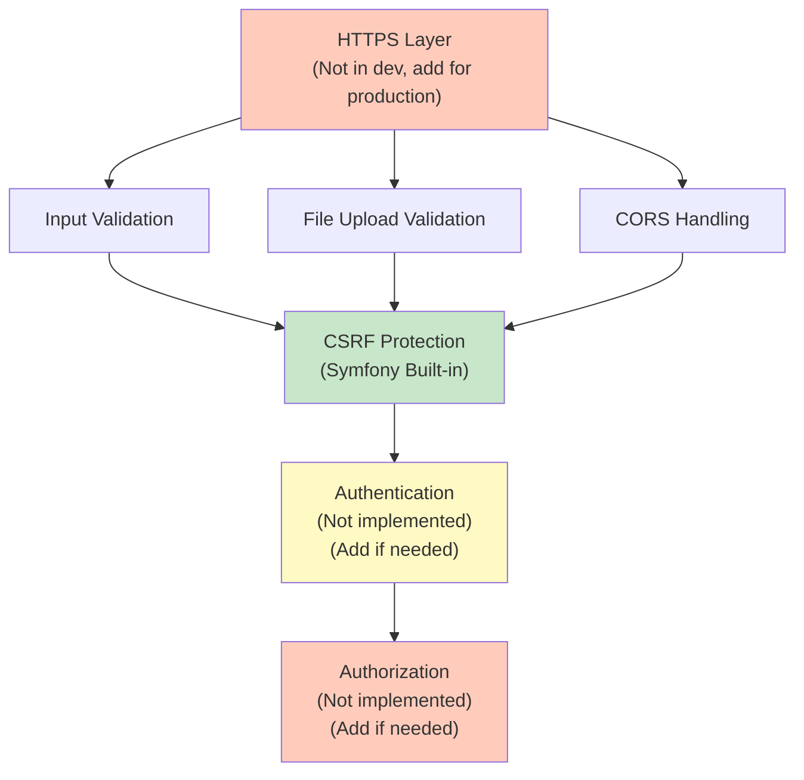
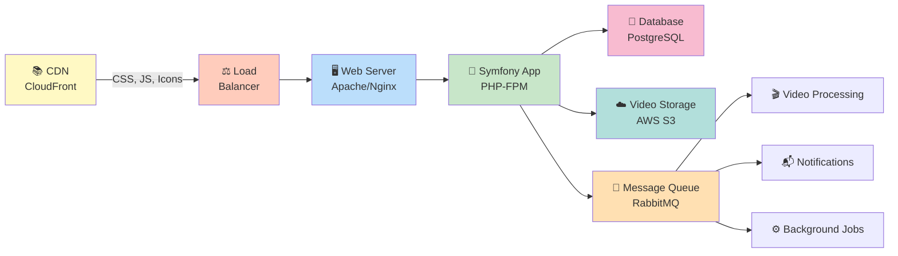

# 🏗️ Architecture Overview

## System Design



## Request/Response Flow

### Recording Upload Flow



### Task Management Flow



## Entity Relationships



### Relationship Rules

- **One Video = One Task** (OneToOne)
- **One Task = One Video** (inverse side)
- **Task MUST have a Video** (Foreign Key NOT NULL)
- **Video CAN have a Task** (nullable inverse side)
- **Cascading Delete**: Deleting a Video also deletes its Task

## Data Flow Diagram

### Creating a Recording



## Technology Stack

### Backend Layers



### Frontend Layers



## File Organization

```
symfony-recorder/
├── src/                          # PHP Source Code
│   ├── Controller/               # Request Handlers
│   │   ├── RecordingController.php
│   │   └── TaskController.php
│   ├── Entity/                   # Database Models
│   │   ├── Video.php
│   │   └── Task.php
│   ├── Form/                     # Symfony Forms
│   │   └── TaskType.php
│   ├── Traits/                   # Reusable Traits
│   │   └── TimestampableTrait.php
│   └── Repository/               # Data Access
│       ├── VideoRepository.php
│       └── TaskRepository.php
│
├── templates/                    # Twig Templates
│   ├── base.html.twig           # Layout
│   ├── home.html.twig           # Landing
│   ├── recording/               # Recording Pages
│   │   ├── index.html.twig
│   │   └── gallery.html.twig
│   └── task/                    # Task Pages
│       ├── index.html.twig
│       ├── show.html.twig
│       ├── edit.html.twig
│       └── components/
│           └── task_list.html.twig
│
├── assets/                       # Frontend Assets
│   ├── app.js                   # Entry Point
│   ├── styles/app.css           # Styling
│   ├── controllers/
│   │   └── recorder_controller.js  # Stimulus
│   └── stimulus_bootstrap.js    # Framework Setup
│
├── public/                       # Web Root
│   ├── index.php                # App Entry
│   └── videos/                  # Video Storage
│
├── config/                       # Configuration
│   ├── routes.yaml
│   ├── routes/routing.controllers.yaml
│   ├── services.yaml
│   └── packages/
│
├── migrations/                   # Database Migrations
│   └── Version20260212195616.php
│
├── var/                          # Runtime Data
│   ├── app.db                   # SQLite Database
│   ├── cache/
│   └── log/
│
└── bin/
    └── console                  # Symfony CLI
```

## Security Architecture



## Deployment Architecture (Future)



---

This architecture ensures:
- ✅ Clean separation of concerns
- ✅ Scalability for future growth
- ✅ Security best practices
- ✅ Maintainability and testability
- ✅ Performance optimization paths

